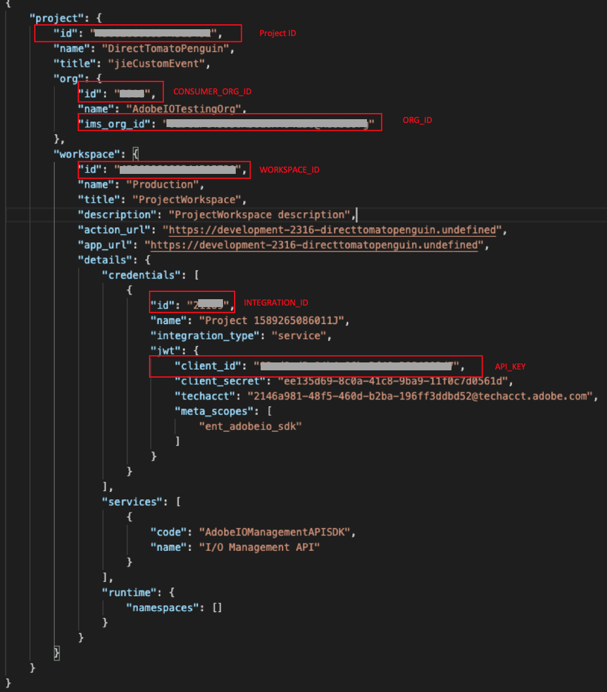
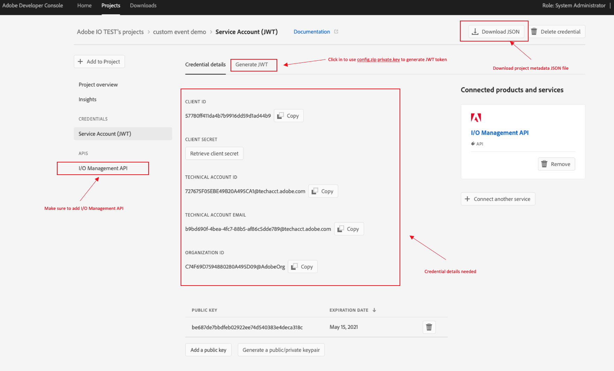

## Lesson 1: Create a Console Integration and Set up project 

### Create a Console Integration 
In order to use custom event SDK, you need to get below informtion from console integration.

- `IMS Org Id`: The Organization Id for which the provider, event metadata, etc are to be created which can be obtained using the Console or Transporter API.
- `API key`: The API Key ( client id ) for the integration ( project workspace ) 
- `JWT Token`: Note that I/O Management Service needs to be enabled for the integration
- `Config.zip`: Config file downloaded from console including private key and certificate_pub.crt
- `project.json`: for instance, `projectname-orgId-Production.json` file downloaded from console 


1. Navigate to Adobe I/O console at [https://console.adobe.io](https://console.adobe.io) in your browser and create a project or using your exsiting project 
2. Select `Add to Project` -> `Add an API` -> `Adobe Services` -> `I/O managemenet API`


3. Follow the steps to configure API, create a new service account (JWT) credential, `config.zip` will be
downloaed automatically, you will need the private key to generate JWT token 

4. Go to `project overview` tab, download project metadata from below `download` button and get the needed info from this `.json`file 



5. Get credential details information, generate JWT 



### Set up project 
After set up your integration and collect the informations, you can start set up your project 
* Add `package.json` it contains the list of dependencies, version, reproducible builds, etc.
* Fill in `.env` file with credentials from above 
* Set environment variables   

1. `package.json` sample file
```javascript
{
  "name": "helloworld",
  "version": "1.0.0",
  "repository": "https://github.com/adobe/aio-lib-events/",
  "description": "",
  "main": "index.js",
  "scripts": {
    "start": "node index.js"
  },
  "author": "",
  "license": "ISC",
  "dependencies": {
    "dotenv": "^8.1.0",
    "@js-joda/core": "^2.0.0",
    "@adobe/aio-lib-events": "1.0.0"
  }
}
```

2. Fill in the required credentials 

Create a `.env` file in the same folder and fill in the credentials you get from console integration
```javascript
EVENTS_ORG_ID=
EVENTS_API_KEY=
EVENTS_CONSUMER_ORG_ID=
EVENTS_WORKSPACE_ID=
EVENTS_PROJECT_ID=
EVENTS_INTEGRATION_ID=
```

3. Set environment variables 

Open terminal and run below
```bash
export EVENTS_INGRESS_URL='https://eventsingress.adobe.io'
export EVENTS_BASE_URL='https://api.adobe.io'
```
Now you should get all the information you need to start using your Event SDK 

Next lesson: [Explore Custom Event SDK](lesson2.md)