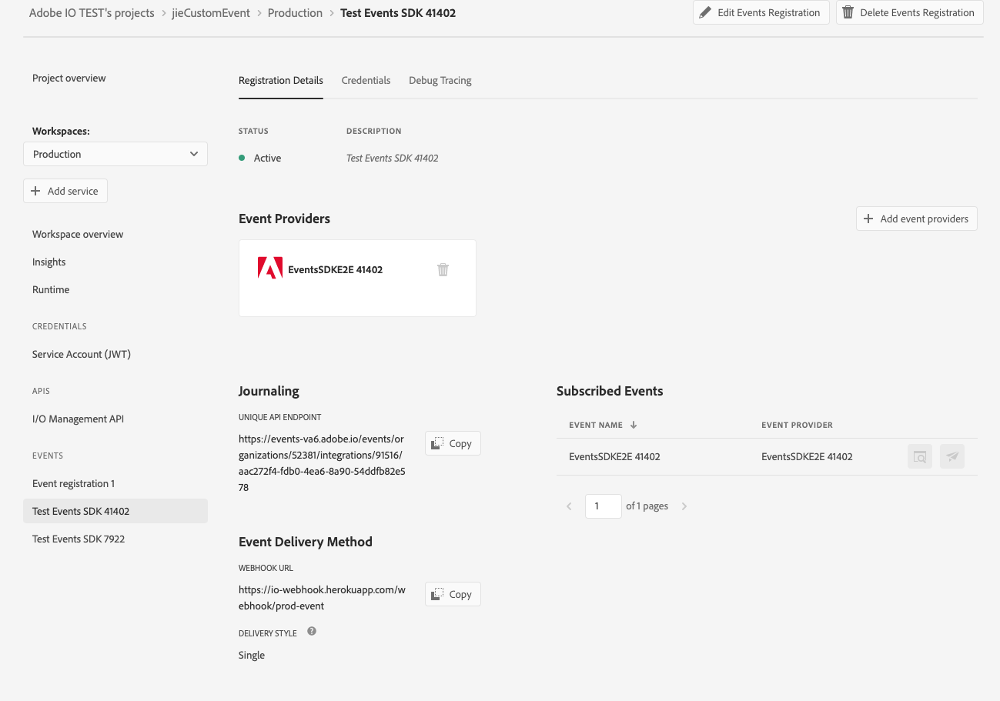

## Lesson 2: Register the App as Event Provider 

### Create a Console Integration and Set up Project
In order to use custom event SDK, you need to get below informtion from console integration.

- `IMS Org Id`: The Organization Id for which the provider, event metadata, etc are to be created which can be obtained using the Console or Transporter API.
- `API key`: The API Key ( client id ) for the integration ( project workspace ) 
- `JWT Token`: Note that I/O Management Service needs to be enabled for the integration
- `Config.zip`: Config file downloaded from console including private key and certificate_pub.crt
- `project.json`: for instance, `projectname-orgId-Production.json` file downloaded from console 


1. Navigate to Adobe I/O console at [https://console.adobe.io](https://console.adobe.io) in your browser and create a project or using your exsiting project 
2. Select `Add to Project` -> `Add an API` -> `Adobe Services` -> `I/O managemenet API`


3. Follow the steps to configure API, create a new service account (JWT) credential, `config.zip` will be
downloaed automatically, you will need the private key to generate JWT token 

4. Go to `project overview` tab, download project metadata from below `download` button and get the needed info from this `.json`file, or you can also get these info from `.aio` file in the project folder.


5. Get credential details information, generate JWT 


### Set up project and use CLI to register the app as event provider
After set up your integration and collect the informations, you can start set up your project 
* Add `package.json` it contains the list of dependencies, version, reproducible builds, etc.
* Use CLI to create provider, eventmetadata and webhook registration

1. `package.json` sample file
```javascript
{
  "name": "helloworld",
  "version": "1.0.0",
  "description": "",
  "main": "index.js",
  "scripts": {
    "start": "node index.js"
  },
  "dependencies": {
    "dotenv": "^8.1.0",
    "@js-joda/core": "^2.0.0",
    "@adobe/aio-lib-events": "1.0.0"
  }
}
```

2. Use CLI to create provider, eventmetadata and webhook registration

Now we can start using CLI to create provider, eventmetadata and webhook registration
first you need to install the Adobe I/O Events CLI Plugin
```bash
npm install -g @adobe/aio-cli-plugin-events
```
after installation, run the below commands:

```bash
aio console org list
aio console org select <orgId>
aio console project list
aio console project select <projectid>
aio console workspace list
aio console workspace select <wkspId>
aio app use
aio event => this will list all the commands for events.
```

### Register the Event Provider
After select the right org, project and workspace, now we start create register the event provider
```bash
aio event provider create
```
Fill in the information, and in the terminal you will see the provider id after successfully create provider, copy <provider id> and then next step:
```bash
aio event eventmetadata create <provider id>
```
CLI will promote you to the question asking you to input the `label` and `event code`for the eventmetadata
Now you can start create registration by 
```bash
aio event registration create 
```
It will show you a sample of a file in JSON format with the information to create a new Event Registration
which you can copy, fill in details and use it. 

Now with all that we have finished register the event provider

Note, another option to register an event provider, is to run javascript code
For your convenience,the source code is available [here](https://github.com/AdobeDocs/adobeio-codelab-event-provider-registration)
simply fill in the `.env` and run `npm start` 

### Check your result on Console
After using event SDK to create an event provider, you will see event provider registrated in console 
as well as your jouranling end point
 

Note: You will need your `event provider id` from this lesson to fire event in next steps:

Next lesson: [Lesson3](lesson3.md)